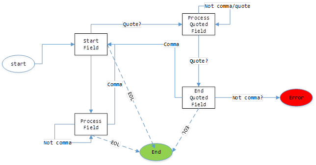

## Question
Implement a Comma separated value parser. This parser should handle the following two cases:
* Handle escaped strings within the line 
	* ``` First \"Value\", "Second Value" ``` 
	* Two strings ```First "Value"``` and ```Second Value``` are returned. 
* Handle whole Quoted strings (String field begins and ends with quotes)
	* ```"\"This is a , whole value\", Second Value```
	* Two strings are returned: ```This is a , whole value``` and ```Second Value```

## Solution
We will use a state machine to handle the parsing. State machines allow extensibility if some parsing rules change.


