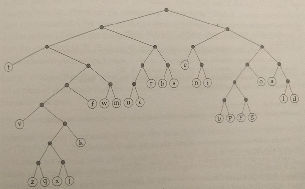

## Question
Given a set of symbols with corresponding frequencies, find a code book that has the smallest average code length.

**Example**

| Character	| Frequency	|
| --------- | --------- |
| a			| 8.17		|
| b			| 1.49		|	
| c			| 2.78		|	
| d			| 4.25		|	
| e			| 12.70		|	
| f			| 2.23		|	
| g			| 2.02		|	
| h			| 6.09		|	
| i			| 6.97		|	
| j			| 0.15		|
| k			| 0.77		|
| l			| 4.03		|
| m			| 2.41		|
| n			| 6.75		|
| o			| 7.51		|
| p			| 1.93		|
| q			| 0.10		|
| r			| 5.99		|
| s			| 6.33		|
| t			| 9.06		|
| u			| 2.76		|
| v			| 0.98		|
| w			| 2.36		|
| x			| 0.15		|
| y			| 1.97		|
| z			| 0.07		|

## Solution
1.	Sort characters in increasing order of frequencies and create a binary tree node for each character. Denote the set just created by S.

2.	Create a new node n whose children are the two nodes with smallest frequencies and assign n’s frequency to be the sum of the frequencies of its children.

3.	Remove the children from S and add n to S. Repeat step (2) till S consists of a single node, which is the root.

| Character	| code		|
| --------- | --------- |
| a			| 1110		|
| b			| 110000	|	
| c			| 01001		|	
| d			| 11111		|	
| e			| 100		|	
| f			| 00101		|	
| g			| 110011	|	
| h			| 0110		|	
| i			| 1011		|	
| j			| 001001011	|
| k			| 0010011	|
| l			| 11110		|
| m			| 00111		|
| n			| 1010		|
| o			| 1101		|
| p			| 110001	|
| q			| 001001001	|
| r			| 0101		|
| s			| 0111		|
| t			| 000		|
| u			| 01000		|
| v			| 001000	|
| w			| 00110		|
| x			| 001001010	|
| y			| 110010	|
| z			| 001001000	|

